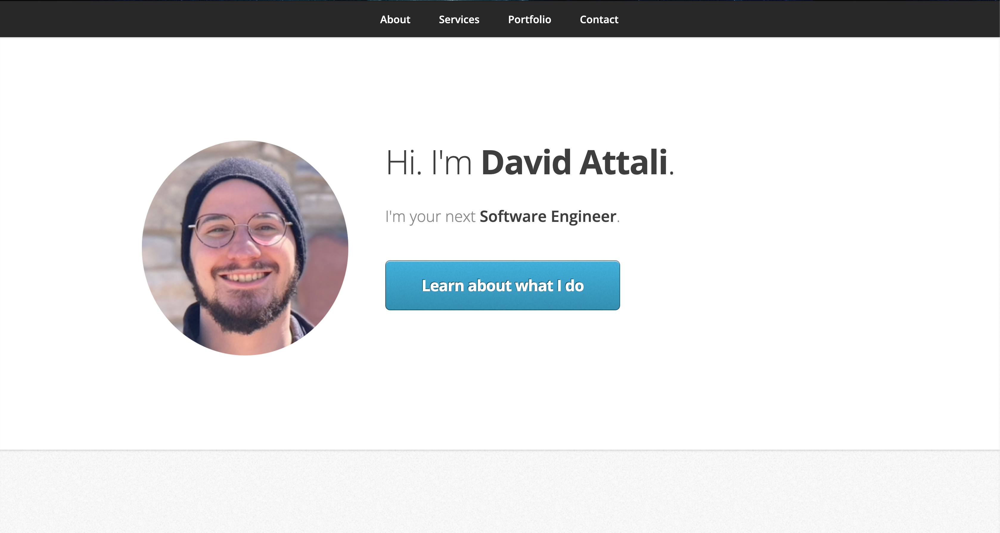

  
  
  
  

I’m a software engineer apprentice @100Devs with a background in research and education.

See [my website](https://davidattali.netlify.app/) for more information!

<h1 align="center">Projects</h1>
<table bordercolor="#66b2b2">
  
  <tr>
    <td width="50%" valign="top">
      <h3 align="center">Jot</h3>
         
        
         
        

          
    
  
      

        
<strong>React, Bootstrap, CoreUI, & Firebase</strong> - Jot makes reading with purpose a breeze! Jot was designed with English teachers to help students ideate and facilitate meaning-making. 

    </td>
    <td width="50%" valign="top">
      <h3 align="center">Blurb</h3>
         
      
         
        

          
  
  
      

        
<strong>Flask, Bootstrap, PostgreSQL, and Jinja</strong> - A social media app designed with educators to enable students to build identities as readers and grow their digital collaboration and discussion skills.

    </td>
  </tr>
  
  <tr>
    <td width="50%" valign="top">
      <h3 align="center">davidattali.com</h3>
       
        
       
        

  
  
      

        
<strong>HTML5, CSS3, & Javascript</strong> - Portfolio Site including links to my projects and ways to get in contact with me.

    </td>
    <td width="50%" valign="top">
      <h3 align="center">Sci-Fi Mix</h3>
         
      
         
        

          
  
  
      

        
<strong>React & CSS3</strong>With over 600 different characters, test your memory by spotting the next Rick and Morty character.

    </td>
  </tr>
</table>

<h1 align="center">Technologies</h1>

    
    
    
    
    
    
    
    
    
    
    
    
    

---

<h1 align="center">Connect</h1>

  
  
  
  

